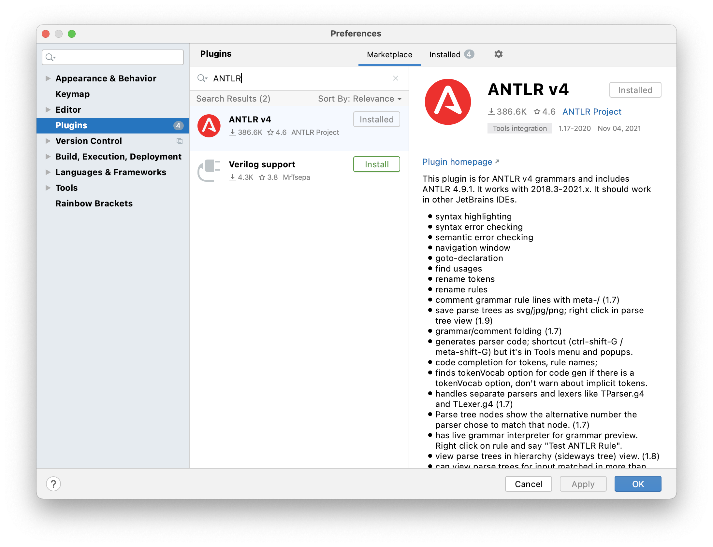

# Develop-in-IDEA-Antlr

本文档的目的在于在IDEA上帮助大家创建一个与本次实验Lab相适配的项目，以便在实验开发过程中使用IDEA提供的丰富的插件和辅助功能，更快捷的完成实验。

⚠️ 如果你已经有自己的coding流程，能够测试，能够提交，请忽略此文档。

## Directly Import

Deciding whether TO DO

直接open folder 然后导入antlr jar包 然后修改.gitignore

## Maven

### 环境配置

在IDEA里，File->New Project-> Maven-> Project SDK可以选择1.8+的版本->next，然后输入项目的路径和名称

.png>)

在`pom.xml` 文件中添加如下内容，然后点击右上角的图标(Load Maven Changes)

```markup
  <dependencies>
    <dependency>
      <groupId>org.antlr</groupId>
      <artifactId>antlr4-runtime</artifactId>
      <version>4.9.2</version>
    </dependency>
  </dependencies>

  <build>
    <plugins>
      <plugin>
        <groupId>org.antlr</groupId>
        <artifactId>antlr4-maven-plugin</artifactId>
        <version>4.9.2</version>
        <executions>
          <execution>
            <id>antlr</id>
            <goals>
              <goal>antlr4</goal>
            </goals>
            <phase>none</phase>
          </execution>
        </executions>
        <configuration>
          <outputDirectory>src/test/java</outputDirectory>
          <listener>true</listener>
          <treatWarningsAsErrors>true</treatWarningsAsErrors>
        </configuration>
      </plugin>
      <plugin>
        <groupId>org.apache.maven.plugins</groupId>
        <artifactId>maven-compiler-plugin</artifactId>
        <configuration>
          <source>8</source>
          <target>8</target>
        </configuration>
      </plugin>
    </plugins>
  </build>
```

在Plugins中搜索ANTLR，安装对应插件



### 项目目录

在`src/main/java`目录下，可以创建每次实验的package

例如L1实验，就可以创建一个`L1` package，在目录下增加本次实验需要的`Main.java` 以及`CmmLexer.g4` 文件。(package的内容与每次实验Lab的src应该具有相同的文件内容，L1实验就至少需要这两个文件）

右键`CmmLexer.g4`，选择Configure ANTLR，填入output directory(选择至java目录即可)和pacakge的内容(L1)，勾选`generate parse tree visitor` (方便之后的实验）

.png>)

编写完`CmmLexer.g4`后，右键`CmmLexer.g4` ，选择Generate ANTLR Recognizer。即可在本package下看到自动生成的文件。

之后就可以根据生成的Java类编写实验代码。

### 提交代码

将你每次实验的package下自定义的java代码，以及`Main.java` 还有`.g4` 文件复制到实验的Lab/src/下，并删除所有Java代码顶部的package声明。

然后在Lab目录下输入`make` /`make test`/`make run FILEPATH=xxx.cmm` 调试，如果没有问题，请选择`make submit` 提交

## Gradle

TODO

